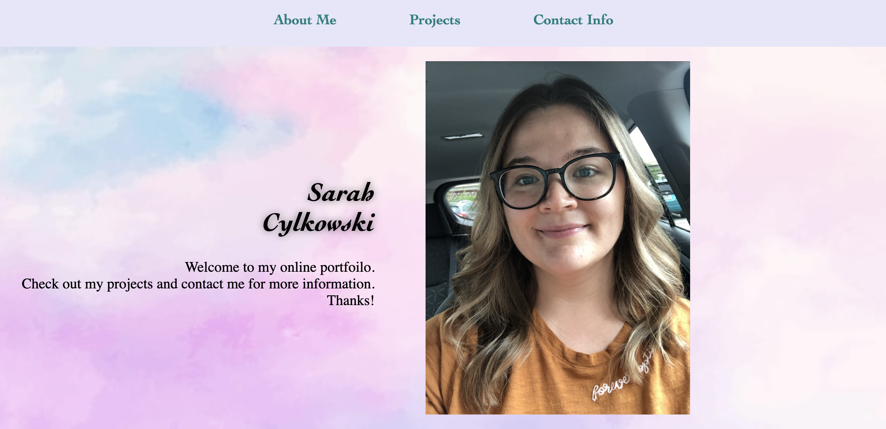

# my-portfolio
 

HTML code includes section ids for the nav bar links to snap to.  There is a name a picture in header at the top.  

There is a contact form at the bottom along with contact information.

Media quaries turn images, text, and forms into columns.  Variables were added to make changing colors easier in the future.

<a href="https://sacylkowski.github.io/my-portfolio/">Here is the link to the webpage</a>

## Questions
 If you have any questions, please reach out on <a href="https://github.com/sacylkowski/">GitHub</a> or you can <a href="mailto:sacylkowski@gmail.com">E-mail me</a>.
